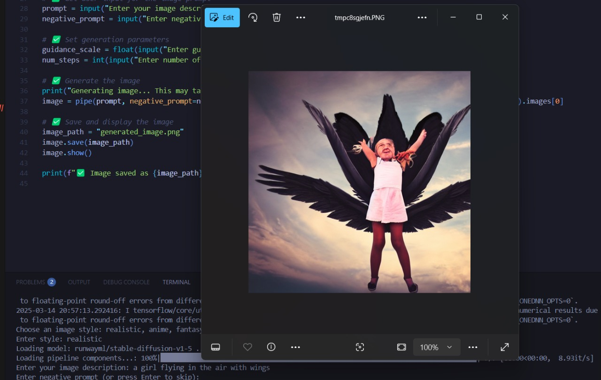

# Stable Diffusion Image Generator  

This project allows you to generate AI-generated images in different artistic styles using Stable Diffusion. You can choose from multiple pre-trained models and customize parameters for better control over the output.  

## Features  
- Supports multiple styles: **realistic, anime, fantasy, pixel art**  
- Uses **Stable Diffusion** via Hugging Face's `diffusers` library  
- Allows **customizable prompts**, **guidance scale**, and **inference steps**  
- Works on **CUDA (GPU) if available** for faster processing  

## Installation  

### 1. Install Dependencies  
Ensure you have Python installed, then run:  

```bash
pip install torch diffusers transformers accelerate pillow
```

### 2. Clone the Repository  
```bash
git clone https://github.com/your-username/stable-diffusion-generator.git
cd stable-diffusion-generator
```

## Usage  

### Run the script  
```bash
python generate.py
```

### Choose a Style  
When prompted, enter one of the following styles:  
- `realistic`  
- `anime`  
- `fantasy`  
- `pixel_art`  

If an invalid option is given, it defaults to `realistic`.  

### Enter Image Description  
You'll be asked for:  
- **Prompt** → The text description for image generation  
- **Negative Prompt** (optional) → What you want to exclude  
- **Guidance Scale** (default: `7.5`) → Controls style adherence  
- **Inference Steps** (default: `50`) → Higher values improve quality  

### Example  
```
Choose an image style: realistic, anime, fantasy, pixel_art
Enter style: anime
Enter your image description: A cyberpunk city with neon lights
Enter negative prompt (or press Enter to skip): Low-resolution, blurry
Enter guidance scale (Default 7.5, higher = more stylized): 8.0
Enter number of inference steps (Default 50, higher = better quality): 75
```

## Output  
- The generated image is saved as `generated_image.png`  
- It is also displayed automatically after generation  

## Example Results  
| Prompt | Style | Output |
|--------|-------|--------|
| `An girl flying with wings` | Realistic |  |

## Performance Tips  
- **Enable GPU**: Make sure you have a CUDA-compatible GPU.  
- **Reduce Memory Usage**: Add `pipe.enable_attention_slicing()` in the script.  
- **Set a Random Seed**: For reproducibility, add:  
  ```python
  import torch, random, numpy as np  
  torch.manual_seed(42)  
  np.random.seed(42)  
  random.seed(42)  
  ```  

## Future Improvements  
- Add an interactive GUI  
- Support for custom Stable Diffusion models  

## License  
This project is open-source under the **MIT License**.  
